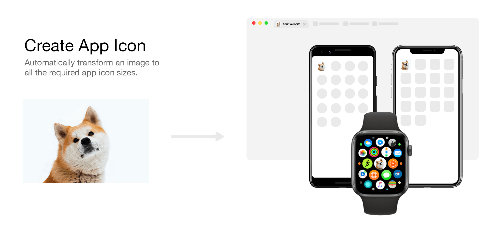

# Create App Icon


Use a single command to resize a local or remote image to all the required sizes and formats used in various forms of development.

## Get Started

### Requirements

- Python 3.6 or higher

### Installation

To get started with the package, run the following commands in your terminal:

```bash
git clone https://github.com/marcusfrdk/create-app-icon.git # or download the repository manually
cd create-app-icon
pip3 install -r requirements.txt
```

_If you are on Windows, use `pip` instead of `pip3`_

### Supported Images

This project uses [Pillow](https://python-pillow.org/) to handle image files, [here's the list.](https://pillow.readthedocs.io/en/stable/handbook/image-file-formats.html)

Only _jpg_, _jpeg_ and _png_ are supported for remote images.

## Usage

### Examples

#### Local image

```bash
python main.py ./path/to/image.jpg
```

#### Remote image

```bash
python main.py https://example.com/image.jpg
```

#### Specific preset

```bash
python main.py ./path/to/image.jpg --{PRESET}
```

#### Align image

```bash
python main.py ./path/to/image.jpg --align top # aligns vertically
```

```bash
python main.py ./path/to/image.jpg --align left # aligns horizontally
```

```bash
python main.py ./path/to/image.jpg --align bottom right # aligns both vertically and horizontally
```

#### Custom Favicon Border Radius

```bash
python main.py ./path/to/image.jpg --radius 15 # percentage (0-100)
```

### Command Line Arguments

| Argument      | Description                           | Type                     |
| ------------- | ------------------------------------- | ------------------------ |
| path          | path or uri to image                  | str                      |
| --ios         | generate ios icons                    | bool                     |
| --ipad        | generate iPad icons                   | bool                     |
| --apple-watch | generate Apple Watch icons            | bool                     |
| --android     | generate Android icons                | bool                     |
| --web         | generate Web icons                    | bool                     |
| -r, --radius  | sets the border radius of the favicon | bool                     |
| -a, --align   | aligns the image                      | top, right, bottom, left |

## Credits

- [Landscape example image](https://unsplash.com/photos/HpVgq2BIjbw)
- [Portrait example image](https://unsplash.com/photos/odJtBMxGEfk)
